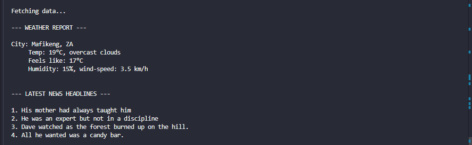
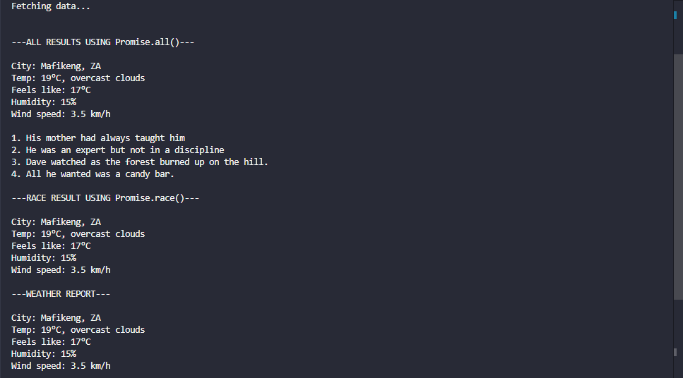
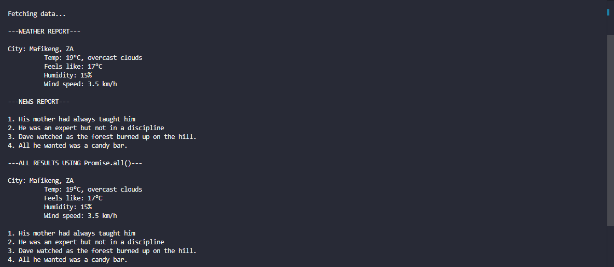

## Async-Weather-News-Dashboard

This project demonstrates fetching weather and news data using three different versions in Node.js: **Callback**, **Promise**, and **Async/Await**. It includes consistent error handling and examples of **Promise.all()** and **Promise.race()** for concurrent requests.

---

## Features

- Fetch current weather by city  
- Fetch latest news headlines(dummy data)  
- Three versions implemented:
  - **Callback**
  - **Promise**
  - **Async/Await**
- **Concurrent requests** using `Promise.all()` and `Promise.race()`    
- Easy to test with simple npm commands  

---

## Built With

- Node.js
- Typescript
- OpenWeather API
- DummyJSON data

---


## Prerequisites

- Node.js v14 or higher installed globally  
- npm installed (comes with Node.js)  
 **Note:** The project will not run without Node.js and npm installed  

---

## Getting Started

### 1. Clone the Repository in your desired directory:
```bash
git clone https://github.com/clementineKgwadi/async-weather-news-dashboard.git
cd async-weather-news-dashboard
```

### 2. # Open the project in VS Code
```bash
code .
```

### 3. Change to dev branch
```bash
 git checkout dev
```

### 4. Install Dependencies on your terminal
```bash
npm install
```

### 5. Create a .env file in the root directory and add your OpenWeather API key:

```env
   OPENWEATHER_API_KEY=your_api_key_here
```

## Usage
**Run the three versions with the following commands:**

```bash
# Callback version
npm run callback

# Promise version
npm run promises

# Async/Await version
npm run async-await

```

**You can also provide a city name as an argument (default is Pretoria):**
```bash
npm run callback Johannesburg

```

---

## Screenshots
**Screenshots show console output for weather and news data for each version.**

### Callback version


### Promise version


### Async/Await version

.png)

---
